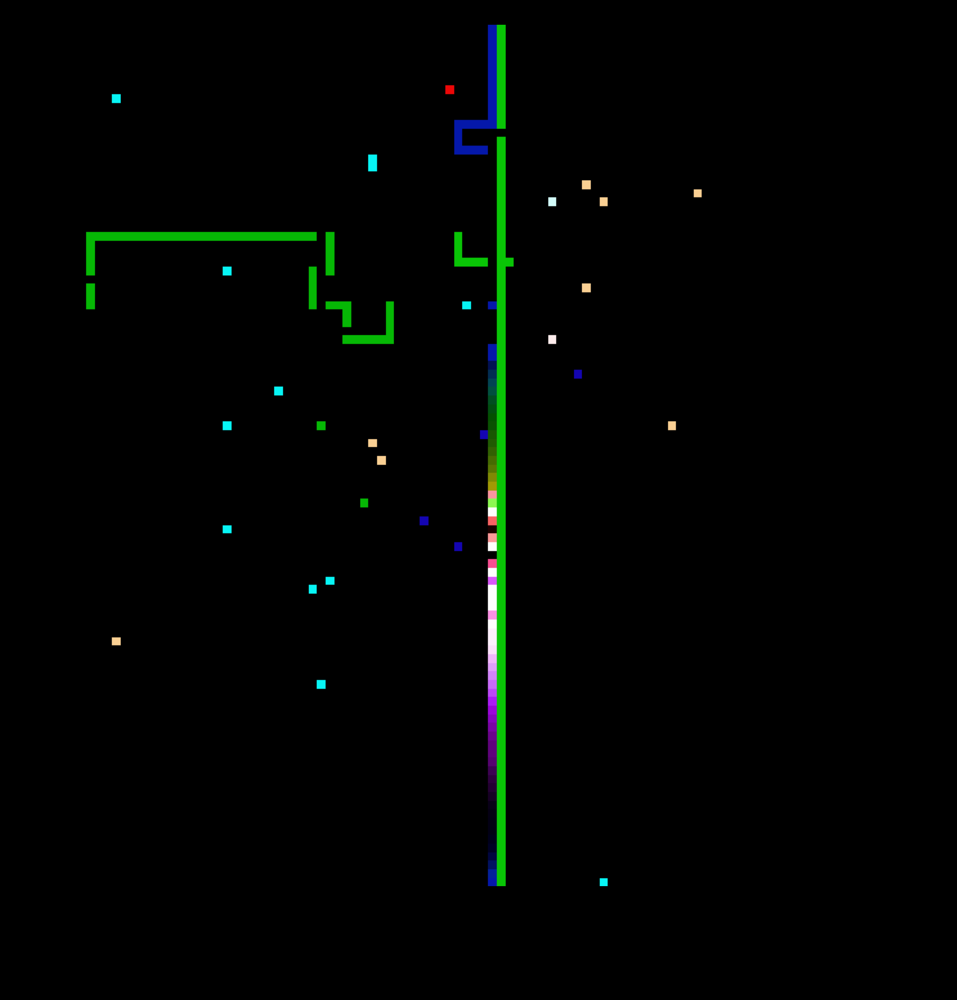

# Snakes on a Plane

Snakes on a Plane is a musical simulation in which each user drives a vehicle that communicates its position to the master patch. The master patch produces a chime using ChucK each time there is an intersection. 

Each path also decays over time so that it appears as a snake. This is a practical consideration to prevent overcrowding of the board. 

Finally, the grid ends up containing uncleared pixels and skipped parts in the path because each user's location is being sent over UDP and there is sometimes packet loss. So this can also be viewed as a musical visualization of UDP packet loss. 

### Authors
- Eric Hayes
- Eric Li
- Julia Wang
- Daniel Wood